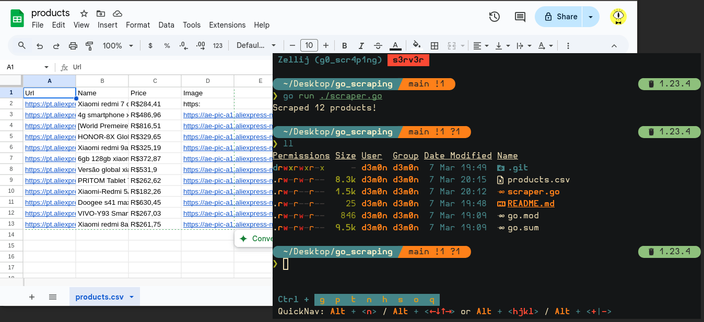

# Golang Web Scraping

A simple web scraping in golang using [colly](https://github.com/gocolly/colly) framework
The script collects product data from **aliexpress.com** and saves the data to a `csv` file
